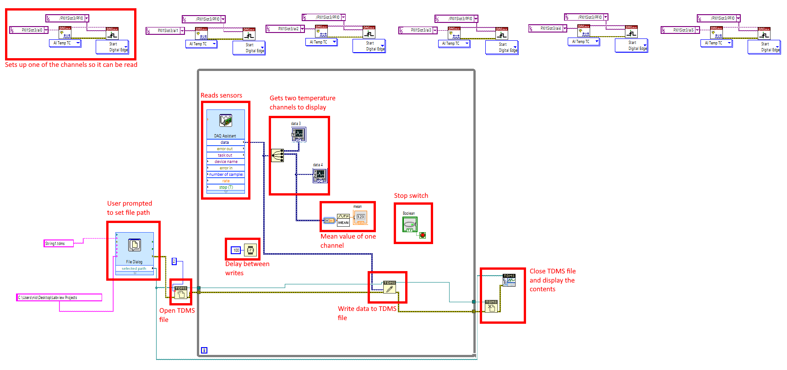
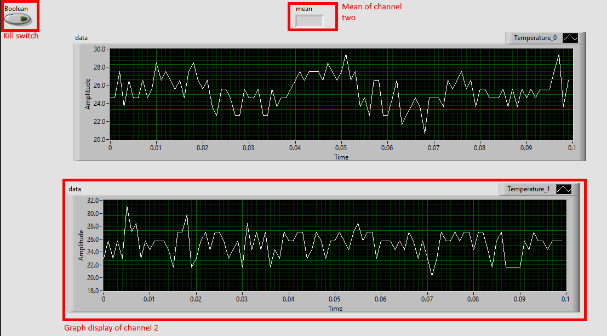
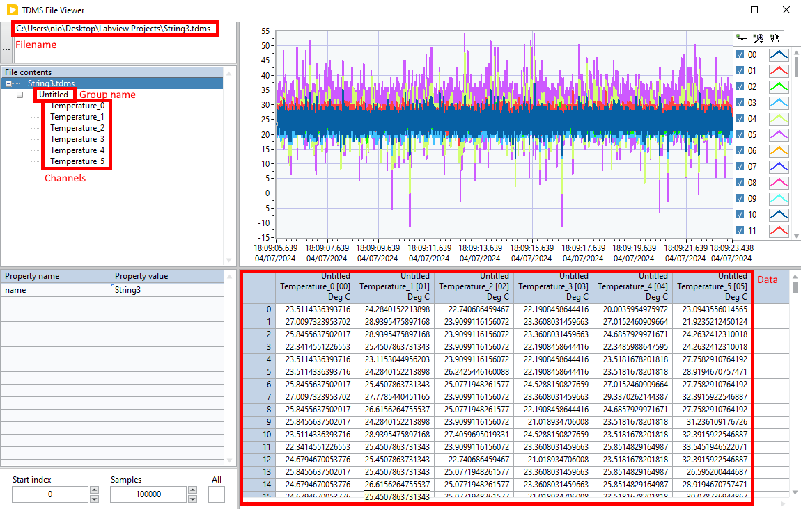
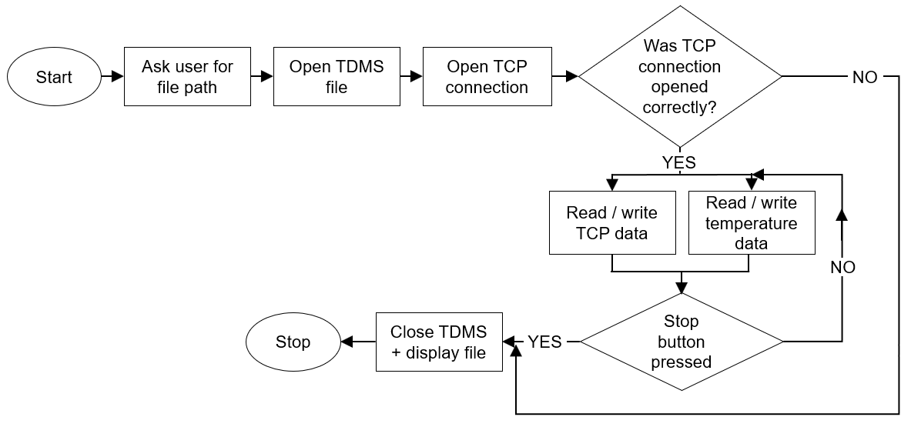

# PXI-DAQ System

## Contents
- [TemperatureDAQExample.vi](TemperatureDAQExample.vi): [LabView](https://www.ni.com/en/support/downloads/software-products/download.labview.html) script for recording temperature data to a TDMS file.
- [Data Receiver.vi](Data%20Receiver.vi): Example LabView for receiving data from the interrogator
- [Interpret string.vi](Interpret%20string.vi): Example code from DAQ manufacturer for parsing TCP string to useable pieces 
- [TCP Receiver.ini](TCP%Receiver.ini): Configuration file for sending strain data via TCP
- [Data Receiver_mod.vi](Data%20Receiver.vi): Modified version of Data Receiver for parsing the data and writing to a TDMS file.
- [WriteStrainTCPToTDMS.vi](WriteStrainTCPToTDMS.vi): SubVI that takes in parsed TCP string and writes it to the TDMS file. Separate from InterpretString
- [Data Receiver_subvi.vi](Data%20Receiver_subvi.vi): SubVI which reads and writes temperature data to TDMS file
- [TempStrainRecord](TempStrainRecord.vi): Combines contents of TCP streaming and temperature recording together

## Description

Repository contains the LabVIEW VIs generated to simulateously record temperature data, and strain values for thermal spray experiments. The goal is to record from several temperature sensors connected to the deposition substrate and the fibre Braggs strain sensors and write to a file.
The PXI-DAQ system used is a national instruments PXI series machine, a specialised computer for precision recording from National Instrument sensor systems. It can simultaneously collect and synchronise data from multiple sensors and write the results into a .tdms file. In this instance, recording temperature data, from N-type thermocouples, and strain values, from fibre Bragg grating optical fibres conencted to an interrogator. The interrogator was an FBGS 904 4-channel interrogator with data streaming by TCP connection.
 

## TemperatureDAQExample.vi

This script is set to record up to 6 temperature channels into a TDMS channel. The DAQ block controls the sampling rate of the sensors which is currently set to 1 kHz. This has been confirmed by checking the timestamps generated in the TDMS file.

When the program is started, the user is prompted to define the file path for the TDMS recording. The recording is then started, and two channels are graphically displayed for debugging purposes.

When the user clicks the stop button, the contents of the TDMS file are displayed.

## [Data Receiver_mod.vi](Data%20Receiver.vi)

This program handles receiving data from the interrogator via TCP streaming. The data is streamed to the local IP (127.0.0.1) and processed. The data is sent as a tab-delimited ASCII string in the following format:

- Date (YYYY/MM/DD)
- Time (HH:MM:SS)
- Linecount (UINT)
- Status of each channel
- Wavelengths
- Power

These are values parsed and converted to either single or arrays of strings

## [Interpret string.vi](Interpret%20string.vi)

This block receives the raw string from the TCP packets and splits it into separate components.

## [TCP Receiver.ini](TCP%Receiver.ini)

Configuration file for the interrogator controlling which TCP streaming features are enabled/disabled.

## [Data Receiver_mod.vi](Data%20Receiver.vi)

A modified version of Data Receiver that takes the parsed TCP parts, converts them to arrays and writes it to a TDMS file. Also on start, the user is prompted to enter the desired filename of the TDMS file.

Depends on [Interpret string.vi](Interpret%20string.vi)

## [TempStrainRecord](TempStrainRecord.vi)

A program that combines the contents of [Data Receiver_mod.vi](Data%20Receiver.vi) and [Data Receiver_mod.vi](Data%20Receiver.vi) into a single (hideous) program that writes both to different groups in the same file. Has extensive error checking to ensure stuff starts/stops properly.

The following schematic shows the program with red rectangles to show the major modules.

The following image is a flowchart summarising the overall program. Data is only written if the TCP connection to the fibre Bragg is successfully opened. If the TCP connection fails to open, the program skips to the end where it displays an empty TDMS file. At present, the program does not check if any thermocouples are connected. If it does connect, data from the TCP connection and thermocouples are written to different, hard-coded groups in the TDMS files. The thermocouple data is written to the Thermocouple group whilst the strain data is written to the Strain group. They cannot be written to the same group due to inconsistencies in the timing for the strain sensors.

